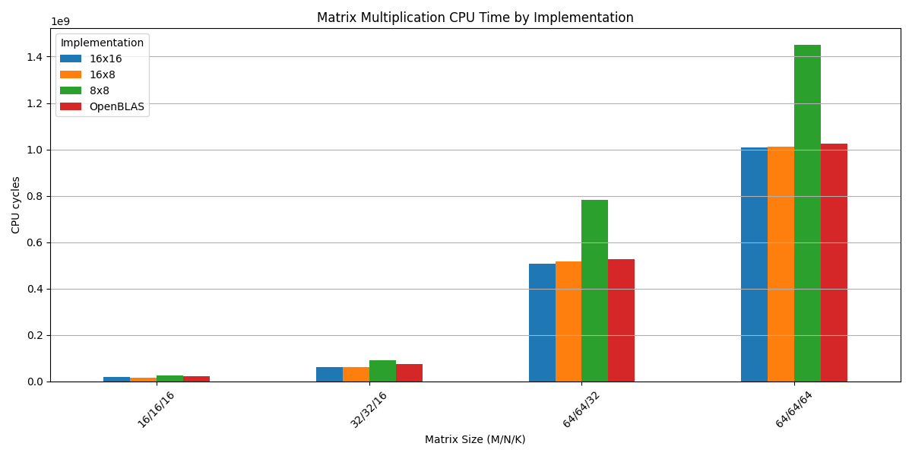

# Оптимизация умножения малых матриц на CPU

Данное исследование посвящено умножению матриц, которые за счет размеров помещаются в L1
кеш CPU и как следствие наиболее эффективно умножаются на единственном ядре.

## Окружение

Использовалась машина с Intel(R) Core(TM) i5-11400F @ 2.60GHz, поддерживающим в том числе расширения AVX2 и AVX512.
Операционная система: Arch Linux kernel 6.13.8. Компилятор: Clang 19.
Для референса в функциональных тестах и тестах производительности использовалась библиотека OpenBLAS 0.3.29.

## Сборка проекта

Гарантируется корректная сборка проекта на x64-машинах с расширениями AVX2 и AVX512 с Linux с компилятором, указанным в окружении выше.

```sh
python3 -m venv .venv
source .venv/bin/activate
pip install conan
conan profile detect --force
conan install . --build=missing --output-folder=build -pr:a=linux_release.profile
cd build
cmake .. --preset conan-release
cmake --build . -j
```

## Реализации умножения матриц

Как уже упоминалось, главная цель работы в оптимизациях в небольшом масштабе, в пределах одного потока,
поскольку размеры матриц таковы, что сами матрицы очень эффективно кешируются в L1.

Начнем с наивной версии:

```c
void matmulNaive(size_t m, size_t n, size_t k, const float* __restrict__ a,
                 const float* __restrict__ b, float* __restrict__ c) {
  memset(c, 0, m * n);
  for (size_t i = 0; i < m; ++i) {
    for (size_t j = 0; j < n; ++j) {
      for (size_t l = 0; l < k; ++l) {
        c[n * i + j] += a[k * i + l] * b[n * l + j];
      }
    }
  }
}
```

Идея оптимизации в замене вычисления одного элемента за раз на вычисление сразу прямоугольными блоками
фиксированного размера, поскольку нам это позволяют векторные расширения Intel AVX. В частности большинство
современных процессоров Intel поддерживают расширения AVX2 и FMA. Реализация с их использованием с размерами блока $8\times8$:

```cpp
#define BLOCK_STRIDE_AVX2 8

static void matmulAvx2Kernel(size_t m, size_t n, size_t k,
                             const float* __restrict__ a,
                             const float* __restrict__ b,
                             float* __restrict__ c) {
  __m256 c0 = {};
  __m256 c1 = {};
  __m256 c2 = {};
  __m256 c3 = {};
  __m256 c4 = {};
  __m256 c5 = {};
  __m256 c6 = {};
  __m256 c7 = {};

  for (size_t l = 0; l < k; ++l) {
    __m256 b_vector = _mm256_load_ps(&b[n * l]);

    c0 = _mm256_fmadd_ps(_mm256_set1_ps(a[k * 0 + l]), b_vector, c0);
    c1 = _mm256_fmadd_ps(_mm256_set1_ps(a[k * 1 + l]), b_vector, c1);
    c2 = _mm256_fmadd_ps(_mm256_set1_ps(a[k * 2 + l]), b_vector, c2);
    c3 = _mm256_fmadd_ps(_mm256_set1_ps(a[k * 3 + l]), b_vector, c3);
    c4 = _mm256_fmadd_ps(_mm256_set1_ps(a[k * 4 + l]), b_vector, c4);
    c5 = _mm256_fmadd_ps(_mm256_set1_ps(a[k * 5 + l]), b_vector, c5);
    c6 = _mm256_fmadd_ps(_mm256_set1_ps(a[k * 6 + l]), b_vector, c6);
    c7 = _mm256_fmadd_ps(_mm256_set1_ps(a[k * 7 + l]), b_vector, c7);
  }

  _mm256_store_ps(&c[n * 0], c0);
  _mm256_store_ps(&c[n * 1], c1);
  _mm256_store_ps(&c[n * 2], c2);
  _mm256_store_ps(&c[n * 3], c3);
  _mm256_store_ps(&c[n * 4], c4);
  _mm256_store_ps(&c[n * 5], c5);
  _mm256_store_ps(&c[n * 6], c6);
  _mm256_store_ps(&c[n * 7], c7);
}

void matmulAvx2(size_t m, size_t n, size_t k, const float* __restrict__ a,
                const float* __restrict__ b, float* __restrict__ c) {
  assert((m & 0x7) == 0);
  assert((n & 0x7) == 0);
  assert((k & 0x7) == 0);
  assert(((uintptr_t)a & 0x1f) == 0);
  assert(((uintptr_t)b & 0x1f) == 0);
  assert(((uintptr_t)c & 0x1f) == 0);

  memset(c, 0, m * n);
  for (size_t i = 0; i < m; i += BLOCK_STRIDE_AVX2) {
    for (size_t j = 0; j < n; j += 8) {
      matmulAvx2Kernel(m, n, k, &a[k * i], &b[j], &c[n * i + j]);
    }
  }
}
```

Здесь для упрощения предполагается что размеры кратны размерам блоков (матрицу можно "замостить" такими блоками)
и указатели выровнены по 32 байта (для операций load и store). Эти предположения закреплены assertions в начале.

Поскольку используемая машина поддерживает также AVX512, была написана и более эффективная полностью аналогичная
реализация с размерами
блоков $16\times8$:

```cpp
#define BLOCK_STRIDE_AVX512 8

static void matmulAvx512Kernel(size_t m, size_t n, size_t k,
                               const float* __restrict__ a,
                               const float* __restrict__ b,
                               float* __restrict__ c) {
  __m512 c0 = {};
  __m512 c1 = {};
  __m512 c2 = {};
  __m512 c3 = {};
  __m512 c4 = {};
  __m512 c5 = {};
  __m512 c6 = {};
  __m512 c7 = {};

  for (size_t l = 0; l < k; ++l) {
    __m512 b_vector = _mm512_load_ps(&b[n * l]);

    c0 = _mm512_fmadd_ps(_mm512_set1_ps(a[k * 0 + l]), b_vector, c0);
    c1 = _mm512_fmadd_ps(_mm512_set1_ps(a[k * 1 + l]), b_vector, c1);
    c2 = _mm512_fmadd_ps(_mm512_set1_ps(a[k * 2 + l]), b_vector, c2);
    c3 = _mm512_fmadd_ps(_mm512_set1_ps(a[k * 3 + l]), b_vector, c3);
    c4 = _mm512_fmadd_ps(_mm512_set1_ps(a[k * 4 + l]), b_vector, c4);
    c5 = _mm512_fmadd_ps(_mm512_set1_ps(a[k * 5 + l]), b_vector, c5);
    c6 = _mm512_fmadd_ps(_mm512_set1_ps(a[k * 6 + l]), b_vector, c6);
    c7 = _mm512_fmadd_ps(_mm512_set1_ps(a[k * 7 + l]), b_vector, c7);
  }

  _mm512_store_ps(&c[n * 0], c0);
  _mm512_store_ps(&c[n * 1], c1);
  _mm512_store_ps(&c[n * 2], c2);
  _mm512_store_ps(&c[n * 3], c3);
  _mm512_store_ps(&c[n * 4], c4);
  _mm512_store_ps(&c[n * 5], c5);
  _mm512_store_ps(&c[n * 6], c6);
  _mm512_store_ps(&c[n * 7], c7);
}

void matmulAvx512(size_t m, size_t n, size_t k, const float* __restrict__ a,
                  const float* __restrict__ b, float* __restrict__ c) {
  assert((m & 0xf) == 0);
  assert((n & 0xf) == 0);
  assert((k & 0xf) == 0);
  assert(((uintptr_t)a & 0x3f) == 0);
  assert(((uintptr_t)b & 0x3f) == 0);
  assert(((uintptr_t)c & 0x3f) == 0);

  memset(c, 0, m * n);
  for (size_t i = 0; i < m; i += BLOCK_STRIDE_AVX512) {
    for (size_t j = 0; j < n; j += 16) {
      matmulAvx512Kernel(m, n, k, &a[k * i], &b[j], &c[n * i + j]);
    }
  }
}
```

## Результаты бенчмарков

Измерялось число тактов CPU, потраченных каждой реализацией, при помощи интринсика `__rdtsc()`.
Каждая реализация вызывалась 100000 раз за бенчмарк.
Для каждой реализации измерения повторялись 8 раз для сведения к минимуму случайных факторов.
Полные данные доступны в [таблице](bench/results.csv). Для наглядности также можно привести
гистограмму среднего числа тактов для разных размеров матриц:



Здесь не была приведена наивная реализация в силу того, что она выполнялась на порядок дольше всех
остальных и очень сильно испортила бы гистограмму. Можно заметить, что мы смогли даже немного обогнать
OpenBLAS. Особенно это заметно на размерах $16\times16\times16$ и $32\times32\times16$.
Очевидно это связано с тем что OpenBLAS рассматривает общий случай, мы же считаем размеры кратными размерам
блоков, а указатели на память под матрицами выровненными. Таким образом мы экономим немного проверок и выигрываем
на совсем малых размерах.
